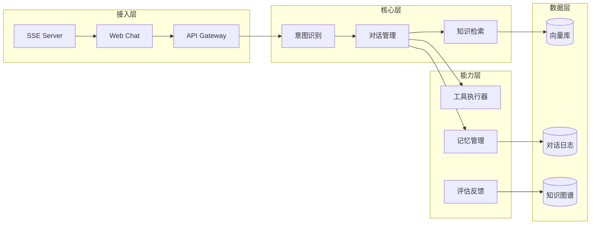

# 智多星 — 系统架构

## 整体架构图

## 核心模块说明

### 接入层

负责多端统一接入，包括 Web Chat 前端、API Gateway 路由、SSE Server 流式推送。

### 核心编排层

- **意图识别** — 基于 fine-tuned LLM 的多分类模型，支持 50+ 业务意图
- **对话管理** — LangGraph 状态图，管理多轮对话流转与工具调度
- **知识检索** — 混合检索策略（向量 + BM25 + 知识图谱），支持多路召回与重排序

### 数据层

- 向量库：Milvus，存储文档 Embedding
- 对话日志：PostgreSQL，全量对话记录与分析
- 知识图谱：Neo4j，存储业务实体关系

## 部署架构

- 容器化：Docker + Kubernetes
- CI/CD：GitHub Actions
- 监控：Prometheus + Grafana
- 日志：ELK Stack
