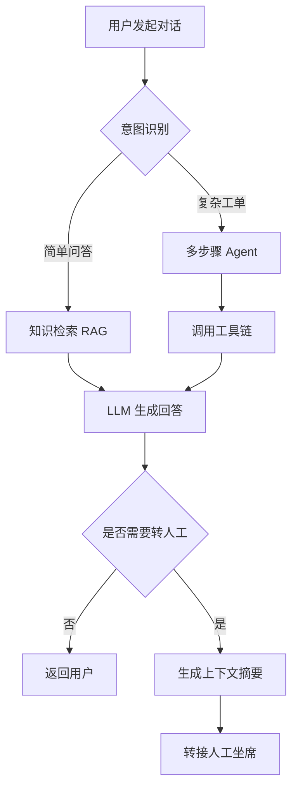

# 智多星智能客服 — 业务流程

## 核心对话流程

## 客服路由决策

| 条件 | 路由目标 | 说明 |
|:---|:---|:---|
| 意图置信度 > 0.85 | 直接回答 | 高置信度走 RAG |
| 意图置信度 0.6-0.85 | 多轮澄清 | 追加追问确认 |
| 意图置信度 < 0.6 | 转人工 | 低置信度直接转 |
| 用户情绪负面 | 转人工 | 检测到愤怒/失望 |
| 涉及退款/投诉 | 转人工 | 高风险操作 |

## 异常处理机制

1. **LLM 超时** — 30s 无响应自动降级为规则引擎
2. **知识库空结果** — 提示用户补充信息，同时记录到待优化队列
3. **工具调用失败** — 重试 2 次，失败后走人工兜底

## 技术选型

- 编排框架：LangGraph
- 向量数据库：Milvus
- 流式输出：SSE
- 前端框架：React 18
