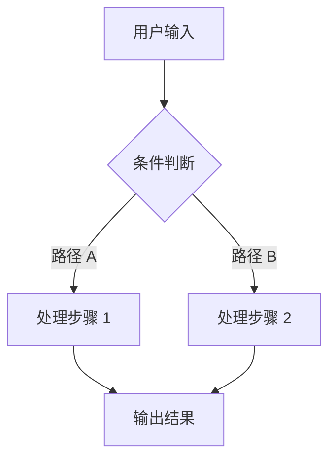

# 页面一：业务流程

## 整体流程

## 关键节点说明

| 节点 | 说明 | 备注 |
|:---|:---|:---|
| 节点 A | 输入处理 | 需要校验 |
| 节点 B | 条件分支 | 支持多路径 |
| 节点 C | 结果输出 | 格式化后返回 |

## 异常处理

1. **超时处理** — 30s 无响应触发降级策略
2. **空结果处理** — 返回默认值并记录日志
3. **重试机制** — 失败后重试 2 次

## 相关文档

- [系统架构](page02.md)
- [功能说明](page03.md)
