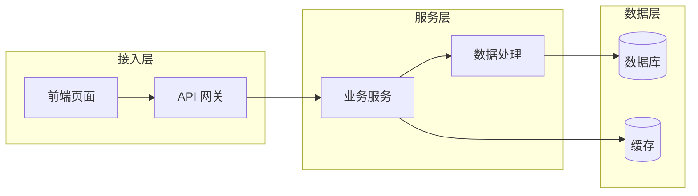

# 页面二：系统架构

## 架构图

## 模块说明

### 接入层

负责处理用户请求，包括页面渲染和 API 路由分发。

### 服务层

核心业务逻辑处理，包括数据校验、业务计算和结果生成。

### 数据层

提供数据持久化和缓存能力，保证数据一致性和访问性能。

## 技术选型

- 前端框架：React 18
- 后端框架：FastAPI
- 数据库：PostgreSQL
- 缓存：Redis
- 部署：Docker + Kubernetes
